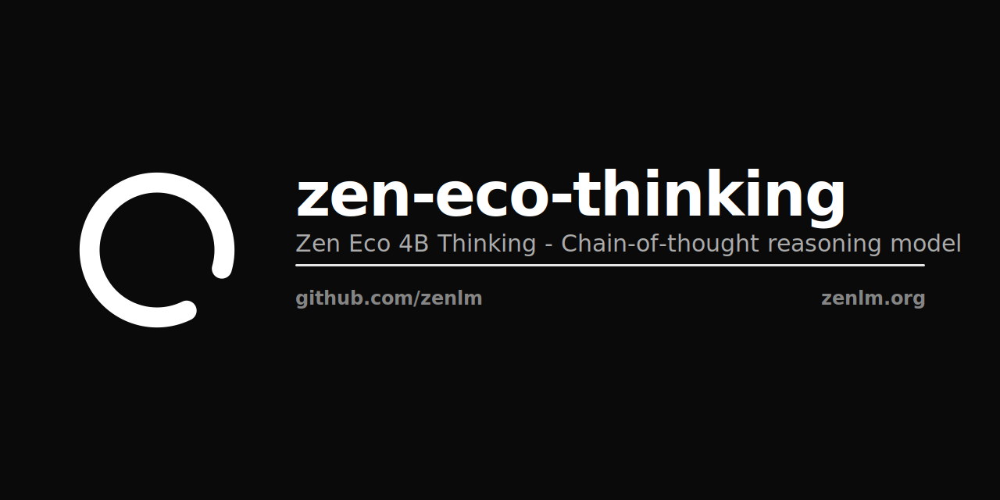

<p align="center"></p>

# Zen Eco 4B Thinking

Chain-of-thought reasoning model. Part of the Zen Eco family.

[](https://opensource.org/licenses/Apache-2.0)

## Overview

Zen Eco 4B Thinking is the chain-of-thought reasoning variant of Zen Eco 4B. Trained to decompose complex problems into step-by-step reasoning chains, achieving stronger performance on math, logic, and multi-step tasks.

| Property | Value |
|----------|-------|
| Parameters | 4B |
| Context | 32K |
| License | Apache 2.0 |

## Usage

```python
from transformers import AutoModelForCausalLM, AutoTokenizer

model = AutoModelForCausalLM.from_pretrained("zenlm/zen-eco-thinking")
tokenizer = AutoTokenizer.from_pretrained("zenlm/zen-eco-thinking")

messages = [{"role": "user", "content": "Solve step by step: If a train travels 120km in 2 hours, then slows to cover 90km in 3 hours, what is the average speed for the entire trip?"}]
inputs = tokenizer.apply_chat_template(messages, return_tensors="pt")
output = model.generate(inputs, max_new_tokens=1024)
print(tokenizer.decode(output[0], skip_special_tokens=True))
```

## Related

- [zen-eco](https://huggingface.co/zenlm/zen-eco) — Base 4B model
- [zen-eco-instruct](https://huggingface.co/zenlm/zen-eco-instruct) — Instruction-tuned variant
- [zen-eco-agent](https://huggingface.co/zenlm/zen-eco-agent) — Tool-calling variant
- [Zen LM](https://github.com/zenlm) — Full model family

Apache 2.0 · [Zen LM](https://zenlm.org) · [Hanzo AI](https://hanzo.ai)
